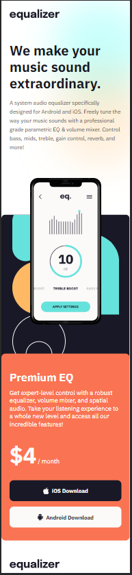
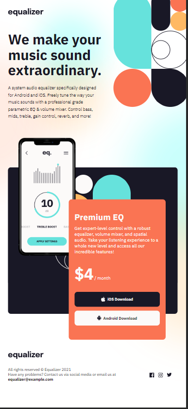
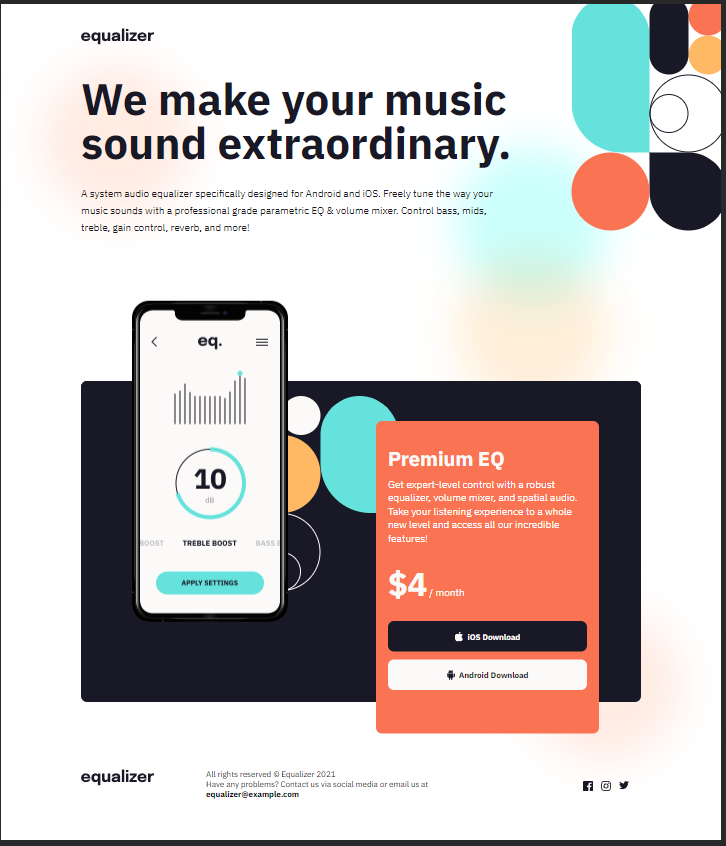

# Frontend Mentor - Equalizer landing page solution

This is a solution to the [Equalizer landing page challenge on Frontend Mentor](https://www.frontendmentor.io/challenges/equalizer-landing-page-7VJ4gp3DE). Frontend Mentor challenges help you improve your coding skills by building realistic projects. 

## Table of contents

- [Overview](#overview)
  - [The challenge](#the-challenge)
  - [Screenshot](#screenshot)
  - [Links](#links)
- [My process](#my-process)
  - [Built with](#built-with)
  - [What I learned](#what-i-learned)
  - [Useful resources](#useful-resources)
- [Author](#author)

## Overview

### The challenge

Users should be able to:

- View the optimal layout depending on their device's screen size
- See hover states for interactive elements

### Screenshot

### Links

- Solution URL: [Add solution URL here](https://your-solution-url.com)
- Live Site URL: [Add live site URL here](https://your-live-site-url.com)

## My process

### Built with

- Semantic HTML5 markup
- CSS custom properties
- Flexbox
- CSS Grid
- Mobile-first workflow

### What I learned

A major takeaway from doing this project was getting more practice with overlapping images using CSS Grid! The middle section of the page was all created using CSS Grid and I heavily used the grid-row and grid-column commands to place the components appropriately.

### Useful resources

- [Change svg on hover](https://css-tricks.com/change-color-of-svg-on-hover/) - This resource helped me to understand how to fill an svg element with a different color on hover.

## Author

- Frontend Mentor - [@rainSax](https://www.frontendmentor.io/profile/rainSax)
